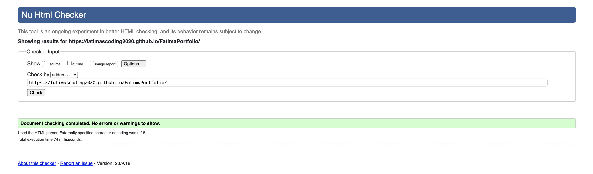
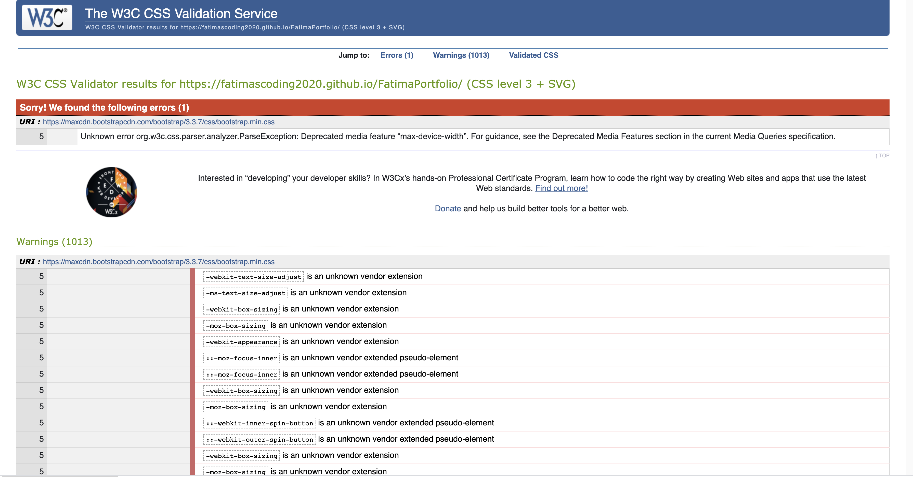

# Testing

### Code validators

[HTML Validator](https://validator.w3.org/) 

The test did not find any errors.

[CSS Validator](https://jigsaw.w3.org/css-validator/) 

The validator displayed 1 error related to [Bootstrap] (https://maxcdn.bootstrapcdn.com/bootstrap/3.3.7/css/bootstrap.min.css)

## Responsiveness

To test the responsiveness of the website I used the [Chrome DevTools](https://developers.google.com/web/tools/chrome-devtools) and [Responsive Design Checker](https://www.responsivedesignchecker.com/).

The design is responsive in all screen sizes and different devices.

## Browser compatibility

I have tested this site across multiple devices and browsers :

- Besides Google DevTool, I have used Firefox and Safari.
- The website was tested on various devices.

The appearance and responsiveness is good on all browsers.

## Testing User stories

 As a site-owner, I want a user-friendly navigation.
- The user can easily go through Font Awesome icons on fixed navbar and that would take to exact section.To go top of the page the user can click on the logo.

 As a site-owner, I want to showcase my skills as a web developer.
- The user can go to the skills section by clicking 'skills' on the navbar.

 As a site-owner, I want to show a brief summary of my projects and technologies I learnt.
- The user can click 'My Work' which will take to the section showing brief description of projects and GitHub repository which is a link.

 As a site-owner, I want prospective employers to easily access information they need.
- The user has an option of downloading CV and quick navigation to work and skills sections.

 As a site-owner, I want my website to be easy recognisable through the icon in the tab. 
- I have added the favicon icon which will help them recognise the website.

 As a site-owner, I want employers to access my social media profile links through Font Awesome icons on the fixed navigation bar and footer while navigating through the website.
- The user can go through more background information by clciking on GitHub and LinkedIn, blog and downloadable CV.

 As a site-owner, I want to ensure compatibility and responsiveness across multiple browsers and mobile devices.
- The appearance and responsive is good on browsers.

 As a user, I want to navigate easily throughout the website.
- The icons andtext, the toggle button helps navigate easily on all devices.

 As a user, I want to know the background of the software developer and the showcased work and skills.
 - The LinkedIn profile, GitHub, Blog and downloadable Cv will provide more detailed information.

 As a user, I want to contact the developer for any projects in mind and to get more information.
- The user can use the contact form to get in touch.

 As a user, I want to easily download the pdf version of the CV.
- The header and footer both have links.
